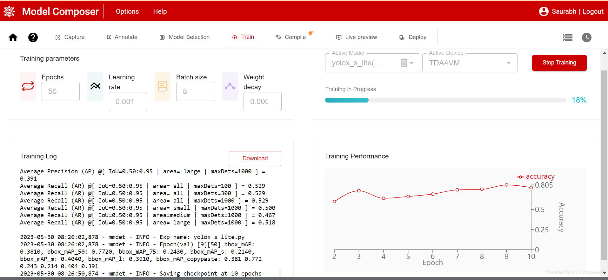
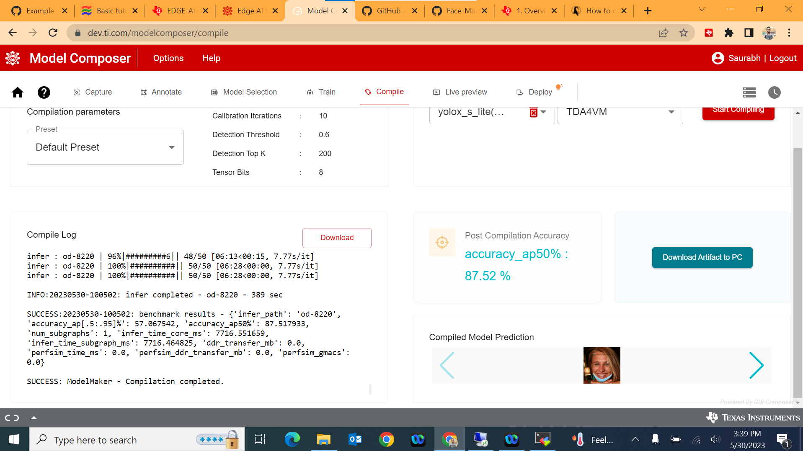
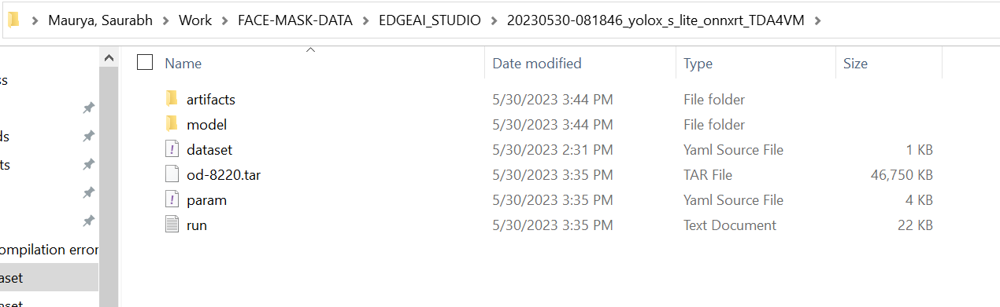
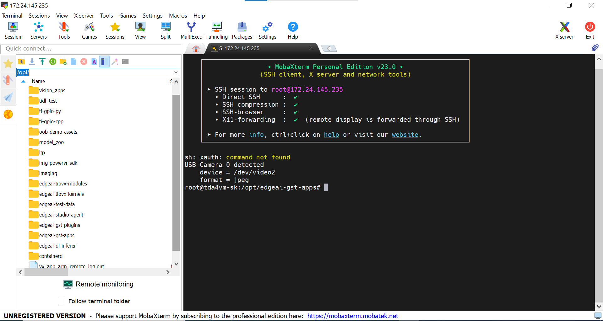
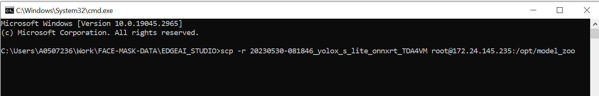

# Edge AI GStreamer Apps
> Repository to host GStreamer based Edge AI applications for TI devices

This Github Repository adds support for **Face Mask Detection** Using [EDGE-AI-STUDIO](https://www.ti.com/tool/EDGE-AI-STUDIO) Model Composer  for TI Embedded Processor.

## Face Mask Detection
Face Mask detection is the task of detecting whether or not a person is wearing a mask. 
This Project will catogorise a person in one of the three catogories.
1. With Correct Mask
2. With Incorrect Mask
3. No Mask

This Project usese Objcet detection in Edge AI Studio to Classify the Person in one of the three Categories and make Bounding boxex around their faces.

## Understanding and Connecting Devives
A Link of Detailed Documentation of the Devices are given below:
1. TDA4VM : (https://software-dl.ti.com/jacinto7/esd/processor-sdk-linux-edgeai/TDA4VM/08_06_00/exports/docs/common/sdk_overview.html)
2. AM62A  : ( )
3. AM68A  :

The above documents tells in details how to start the board, and run the sample apps on that.

## Edge AI Studio Model Composer
The [Edge AI studio model composer](https://dev.ti.com/modelcomposer/) train , optimize and Compile the AI model for TI Embedded Processor. 
Currently, the Edge AI Studio can compose Object detection and Image Classification Task.

**Supported Devices for Edge AI Studio Model Composer**

| **DEVICE**              | **Supported**      |
| :---:                   | :---:              |
| AM62A                   | :heavy_check_mark: |
| AM68A                   | :heavy_check_mark: |
| SK-TDA4VM               | :heavy_check_mark: |

## Steps to Use Edge AI Studio Model Composer
Below are the steps to use Edge AI Studio Model Composer

### 1. Creating the project
1. Click on create new project.
2. From task type Drop Down menu select "Object detection" or "Image Classification" based on the task.
3. Write name of project
4. Click Start Composing

### 2. Dataset Preparation
Data can taken from various input sources. Click on the Input Source.
1. **PC Camera:** The Images can directly be taken using Inbuilt PC camera. Click on the PC Camera and select a Camera from the available Camera list, Select the image format from "JPG" and "PNG".
2. **Device Camera:**
3. **Import Images from Local PC:** Existing datasets can be imported directly in JPG, PNG format. Click onImport Images from Local PC. Select a folder from the local PC. On the right panel select the images and click Confirm.  
4. **Import Annotated Archive dataset:** Annotated archive data can also be imported.

:o: *Note that the data annotated outside the edgeAI Studio can not be imported. Only the data which are annotated and Downloaded from edge AI studio, that can be uploaded.*

### 3. Data Annotations
Once dataset is imported, data annotation can be done.

**Steps for annotating For Object Detection:**
1. Select a image from the left panel.
2. Click on the Square like shape left to the image.
3. Drag on the image where Box is to be drawn.
4. Fill / Select the lable in pop up.
5. Repeat for All the images.
Note: Image can be zoomed , dragged aside also. Try all the icons left to the image.

**Steps for annotating For Object Detection:**
1. In classification first add all the label.
2. Click on the '+' icon on the top right.
3.  In the Pop Up window, Click on the + icon on the bottom left.
4.  Enter the lable name and hit enter.
5.  Now select image from the left panel and select the lable from right panel.
6.  Repeat for all the images.

Once Done with the annotations, the annotated data can be downloaded by clicking on Download symbol above the left panel.
It is recommended to Download the Annotated Data, incase by mistake project got deleted.


### 4. Model Selection
Once all the data is annotated, move to the next section.\
**Device Selection:** Select the Target device. Drag the slider to find the best trade-off between power and performance for your task.\
**Model Selection:**  Select a model acording to the need "faster accuracy" or "faster Perfomance"

### 5. Train
Tune the training Parameter Acording to need. And Click on the start training button on the top-right.
The trainig Perfomance will be Shown as shown in below image.



Once the model is trained go to the next Section Compilation.


### 6. Compilation
In Compilation Section, Choose the compilation parameters from the drop down.
If accuracy is not priority and only you need to compile to see the result select the "Best Speed Preset". 
After that Hit Start Compiling.
It will take some good amout of time.

After Compilation is over, the screen will be something like below image.



Click on **Download the Artifact to PC** to Download the Compied model on the Local PC.

:o: Note: Download the model to your PC before closing the browser. It will not be available when you log in again if you do not download it first.

The Downloded model will look like this:



### 7. Live Preview


### 8. Deployment on Board
Model can be Deployed on the board in two ways:
1. Connect the board and click Deploy model on board.
2. Manually Copying the Model on the board.

**Connecting Board to PC using UART**
1. Install the [MobaXterm](https://mobaxterm.mobatek.net/download.html) to the PC to remotely connect to the Board.
2. Once installed connect the board to the PC through the UART cable. 
3. Open MobaXterm and Click on session.
4. Click on the Serial and select a Port from the drop down.
5. Baud rate should be configured to **115200** bps in serial port communication program. 

:o: Note: If using a Windows computer, the user may need to install additional drivers for ports to show up. (https://www.silabs.com/developers/usb-to-uart-bridge-vcp-drivers).\
Click on the link. Go to Downloads. Download and install ***CP210x Windows Drivers with Serial Enumerator***.

6. Once the port are visible, Connect to all the ports and Reboot the board. 
7. The boot log will be visible in one of the ports. Other ports may be closed.
8. In login prompt : type `root` as user.
9. Your current directory in terminal will be like: `/opt/edgeai-gst-apps`

**Connecting remotely using SSH**\
 You can also access the device with the IP address that is shown on the display. With the IP address one can ssh directly to the board.\
 In MObaXterm:
 1. Click session
 2. Click SSH
 3. Enter the IP displayed at board
 4. Hit enter
 5. In the login prompt:  type `root` as user.
 
One Can also use **VS code** to remotely login using SSH.

After login when You go to the `/opt` the directory structure will be like this:



`/opt/edgeai-gst-apps`  Contains the apps to run the model.\
`/opt/model_zoo` contains all the model. The downloaded model from the EDGE AI STUDIO will be saved here.\
`/opt/edgeai-test-data` contains the input data ( image , videos to run the model ).


**Copying Downloaded model to the board**

We can use `scp` Command to copy the model from our PC to the borad.
1. Open your terminal
2. Go to the directory where Model is saved.
3. Type the following command:

```scp -r model_folder_name root@ip_address_of_board:/opt/model_zoo```




